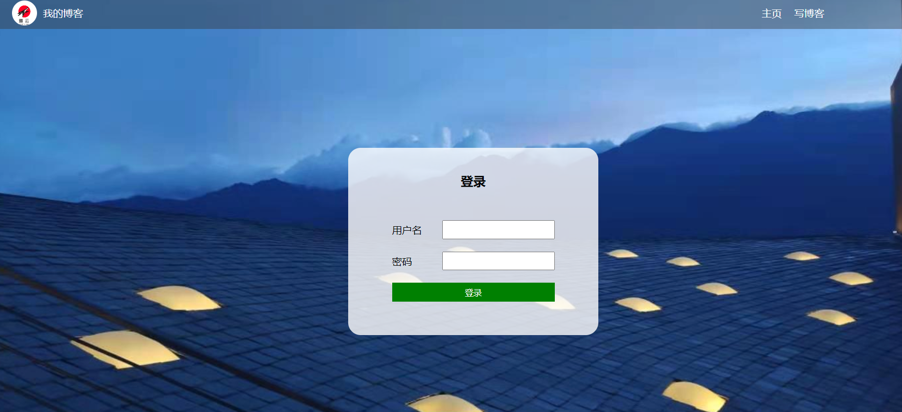
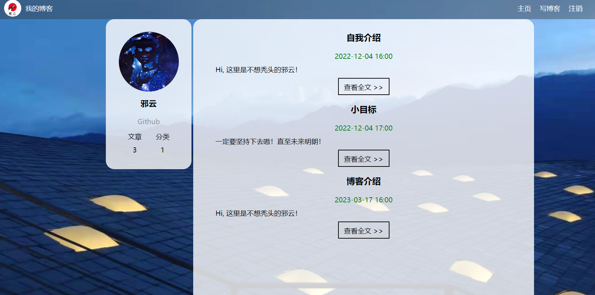
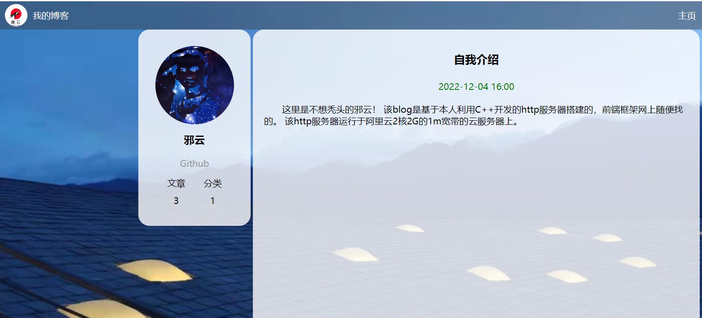
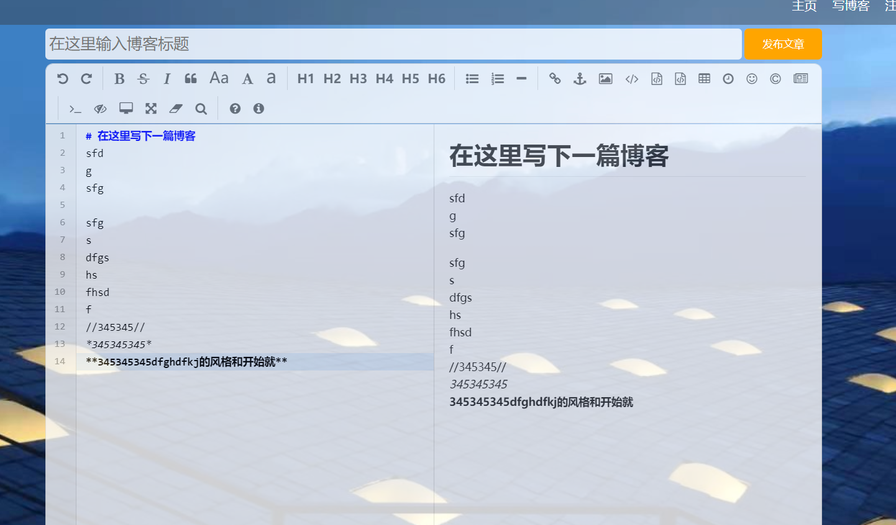

# cppWebServer
一个基于C++11/14的webServer服务器

## 功能
* 利用IO复用技术Epoll与线程池实现多线程的Reactor高并发模型；
* 利用正则与状态机解析HTTP请求报文，实现处理静态资源的请求；
* 利用标准库容器封装char，实现自动增长的缓冲区；
* 基于小根堆实现的定时器，关闭超时的非活动连接；
* 使用gzip实现大文件的分块压缩传输

## 编译

* 发行模式
~~~shell
g++ test.cpp  ./pool/threadPool.cpp   ./http/httpconn.cpp  ./server/webServer.cpp   ./buffer/buffer.cpp  ./server/epoller.cpp ./timer/heaptimer.cpp  ./http/httpRequest.cpp ./http/httpResponse.cpp   -o a.out -lpthread -lz
~~~

* DEBUG模式
~~~shell
g++ test.cpp  ./pool/threadPool.cpp   ./http/httpconn.cpp  ./server/webServer.cpp   ./buffer/buffer.cpp  ./server/epoller.cpp ./timer/heaptimer.cpp  ./http/httpRequest.cpp ./http/httpResponse.cpp   -o a.out -lpthread -lz -D DEBUG
~~~

## 日志

* 使用了std::unordered_map，不能使用#pragma pack(1)，就是不能内存对齐1字节，不能unordered_map在构造的时候会发生段错误。
* 发现定时器bug，不能对father使用size_t类型，如果child=0时，father会发生类型转变，最后等于一个极大值9223372036854775807
~~~c++
void axy::HeapTimer::siftup_(int child) { //节点上升
    assert(child >= 0 && child < (int)heap_.size());
    // size_t j = (child - 1) / 2;   //child == 0时，j = 9223372036854775807
    int father = (child - 1) >> 1;
    TimerNode temp = heap_[child];
    while(father >= 0) {
        if(heap_[father] < heap_[child]) { break; }
        // _swapNode(child, father);
        heap_[child] = heap_[father];
        child = father;
        father = (child - 1) >> 1;
    }
    heap_[child] = temp;
}
~~~

## 学到

### zlib的使用

* flush：如果文件过大时，数据不能一次读取进缓冲区进行压缩，那么flush就为Z_NO_FLUSH，告诉gzip这不是最后一次压缩。如果是最后一次压缩，那么flush为Z_FINISH
* 注意：
* * Z_FINISH对应的正常的返回值为：Z_STREAM_END
* * Z_NO_FLUSH对应的正常的返回值为：Z_OK

==**需要注意的是**==
* zs.avail_out：表示的是用来存储已经被压缩好的数据的缓冲区还有多少个字节的区域没有被使用
所以，压缩好的数据的大小为 max_buff_size - zs.avail_out
* 如果zs.avail_out为0，那么表示需要压缩的数据没有完全被压缩，需要继续进行压缩，直到zs.avail_out不为0

**一个使用例子**
~~~c++
        //压缩
        zs.next_in = (Bytef *)((uint8_t *)_iov[1].iov_base + i * PIECE_ZIP_COND_SIZE/**/);
        zs.avail_in = block_size;
        int flush = (i != block_count - 1) ? Z_NO_FLUSH : Z_FINISH;

        do {
            zs.next_out = (Bytef *)_piece->getBegin();
            zs.avail_out = write_size;

            int rc = deflate(&zs, flush);

            if ((i != block_count - 1) && rc != Z_OK) {
                deflateEnd(&zs);
#ifdef DEBUG
                LOG_WARN("hh\n");
#endif // DEBUG
                return 0; //发送失败
            }

            if ((i == block_count - 1) && rc != Z_STREAM_END) {
                deflateEnd(&zs);
#ifdef DEBUG
                LOG_WARN("gg\n");
#endif // DEBUG
                return 0; //发送失败
            }
            // _iov[1].iov_base = (long *)_iov[1].iov_base + block_size;
            int compressed_size = write_size - zs.avail_out; //压缩后的字节数

        } while (zs.avail_out == 0);
~~~

### 效果

* 增加范围传输功能，前端加了视频播放验证

**前端参考**
* [博客系统（页面设计）](https://blog.csdn.net/weixin_54150521/article/details/128185533)
* [JavaScript案例（六）：前后端交互-登录案例](https://blog.csdn.net/weixin_43969648/article/details/123579580?spm=1001.2014.3001.5501)

**致谢**
* Linux高性能服务器编程，游双著.
* [markparticle](https://github.com/markparticle/WebServer)